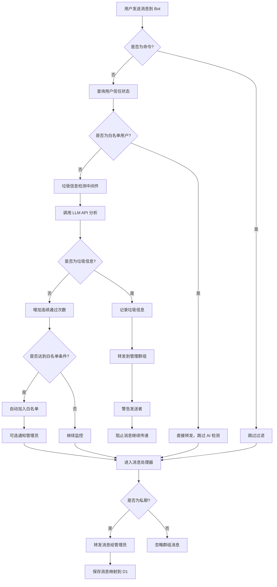
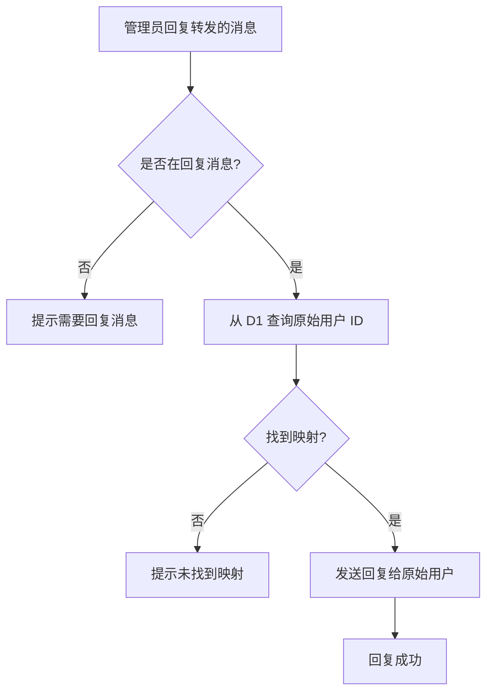

# Telegram Watchdog

一个部署在 Cloudflare Workers 上的智能 Telegram Bot，提供 AI 驱动的垃圾信息过滤和管理员消息转发功能。

## 📋 项目介绍

Telegram Watchdog 是一个功能强大的 Telegram 机器人，主要用于：

1. **AI 垃圾信息检测**：使用 LLM（大语言模型）自动识别和过滤垃圾信息、广告、诈骗等不良内容
2. **智能白名单系统**：自动识别可信用户，减少 AI 检测成本并提升用户体验
3. **管理员消息中继**：自动将用户私聊消息转发给管理员，并支持管理员回复功能
4. **实时监控**：检测到垃圾信息时自动转发到管理群组，提供详细的分析报告

### 主要特性

- 🤖 **AI 智能过滤**：基于 LLM 的智能垃圾信息识别
- ✅ **自动白名单**：用户连续通过 3 次检测后自动加入白名单，跳过后续 AI 检测
- 👮 **管理员命令**：支持 `/trust` 和 `/untrust` 命令手动管理用户信任度
- 💬 **双向消息转发**：用户消息转发给管理员，管理员可直接回复
- 🗄️ **持久化存储**：使用 Cloudflare D1 数据库存储消息映射和用户信任度
- ⚡ **边缘计算**：部署在 Cloudflare Workers，全球低延迟响应
- 🔒 **安全验证**：Webhook 请求使用密钥验证，确保安全性

## 🛠️ 技术栈

- **[Hono](https://hono.dev/)** - 轻量级 Web 框架，专为 Cloudflare Workers 优化
- **[Grammy](https://grammy.dev/)** - 现代化的 Telegram Bot 框架
- **[OpenAI SDK](https://github.com/openai/openai-node)** - 用于调用 LLM API 进行垃圾信息检测
- **[Cloudflare Workers](https://workers.cloudflare.com/)** - Serverless 计算平台
- **[Cloudflare D1](https://developers.cloudflare.com/d1/)** - 边缘 SQLite 数据库
- **[TypeScript](https://www.typescriptlang.org/)** - 类型安全的开发语言
- **[Wrangler](https://developers.cloudflare.com/workers/wrangler/)** - Cloudflare Workers CLI 工具

## 📦 所需外部组件

### 必需服务

1. **Telegram Bot Token**
   - 通过 [@BotFather](https://t.me/botfather) 创建 Bot 并获取 Token

2. **Cloudflare 账户**
   - Workers 服务（免费版即可开始）
   - D1 数据库（免费版提供 5GB 存储）
   - 自定义域名（用于 Webhook，Workers 默认域名也可用）

3. **LLM API 服务**
   - OpenAI API 或兼容的 API 服务
   - 需要 API Key 和 Base URL

### 其他组件

- **管理员 Telegram 账户**：用于接收转发消息
- **管理群组**：用于接收垃圾信息警报

## 📁 项目代码结构

```
telegram-watchdog/
├── src/
│   ├── index.ts              # 主入口文件，Hono 应用和 Bot 初始化
│   ├── env.ts                # TypeScript 环境变量类型定义
│   ├── config.ts             # 白名单系统配置常量
│   ├── bot/
│   │   ├── command.ts        # Bot 命令处理器（/start 等）
│   │   ├── commands.ts       # 管理员命令（/trust、/untrust）
│   │   ├── middleware.ts     # 垃圾信息过滤和白名单检查中间件
│   │   └── message.ts        # 消息转发处理器
│   ├── llm/
│   │   ├── client.ts         # LLM API 客户端和垃圾信息检测
│   │   └── prompt.ts         # LLM 提示词模板
│   └── db/
│       ├── init.ts           # D1 数据库初始化和清理
│       └── trust.ts          # 用户信任度数据库操作
├── package.json              # 项目依赖配置
├── wrangler.jsonc            # Cloudflare Workers 配置
├── tsconfig.json             # TypeScript 配置
└── README.md                 # 项目说明文档
```

### 核心文件说明

- **src/index.ts**：应用入口，配置 Hono 路由和 Grammy Bot，实现懒加载初始化
- **src/config.ts**：白名单系统配置，包括自动晋升阈值等参数
- **src/bot/middleware.ts**：拦截所有消息，检查白名单状态并调用 LLM 进行垃圾信息检测
- **src/bot/commands.ts**：处理管理员命令（`/trust`、`/untrust`）
- **src/bot/message.ts**：处理用户与管理员之间的消息转发逻辑
- **src/llm/client.ts**：封装 OpenAI SDK，提供统一的 LLM 调用接口
- **src/db/init.ts**：创建和维护 D1 数据库表结构
- **src/db/trust.ts**：用户信任度相关的数据库操作

## 🔄 业务流程

### 1. 用户发送消息流程（含白名单检查）



### 2. 管理员回复流程



### 3. 垃圾信息检测流程

```
用户消息 → 提取发送者姓名和消息内容
         ↓
    填充提示词模板
         ↓
    调用 LLM API 判断
         ↓
    解析返回结果
         ↓
    ┌─────────────┬─────────────┐
    │   SPAM:原因  │    CLEAN    │
    ↓             ↓
  垃圾信息      正常消息
```

## ✅ 白名单系统

### 工作原理

白名单系统通过追踪用户的历史行为，自动识别可信用户并跳过 AI 检测，从而降低 API 成本并提升用户体验。

### 用户信任等级

系统为每个用户维护以下状态：

- **`new`（新用户）**：首次发送消息或曾被标记为垃圾的用户，每条消息都需要 AI 检测
- **`trusted`（白名单用户）**：已通过验证的可信用户，消息直接转发，完全跳过 AI 检测
- **`monitoring`（监控中）**：曾被标记为垃圾但正在重新积累信任的用户

### 自动加入白名单

用户满足以下条件后会自动加入白名单：

1. **连续通过 3 次** AI 垃圾信息检测
2. **从未被标记**为垃圾信息（`total_spam_count = 0`）

加入白名单后：
- 用户的所有后续消息直接转发，不再消耗 AI API 配额
- 可选择通知管理员（可在 `src/config.ts` 中配置）

### 管理员命令

管理员可以通过以下命令手动管理用户信任度：

#### `/trust` - 立即加入白名单

**使用方法：**
1. 在转发的用户消息下回复
2. 输入 `/trust`
3. 该用户立即加入白名单，无需等待自动验证

**示例：**
```
[转发的用户消息]
    ↓ 回复
/trust
    ↓ Bot 响应
✅ 用户已手动加入白名单
```

#### `/untrust` - 移除白名单

**使用方法：**
1. 在转发的用户消息下回复
2. 输入 `/untrust`
3. 该用户被移出白名单，重新进入监控状态

**效果：**
- 用户的 `trust_status` 变为 `new`
- `consecutive_clean_count` 重置为 0
- `total_spam_count` 增加 1（防止短期内再次自动加白）
- 后续消息需重新通过 AI 检测

**示例：**
```
[转发的用户消息]
    ↓ 回复
/untrust
    ↓ Bot 响应
⚠️ 用户已移除白名单，重新进入监控
```

### 白名单配置

可以在 `src/config.ts` 中调整白名单系统的行为：

```typescript
export const WHITELIST_CONFIG = {
  // 自动加白所需的连续通过次数（默认 3）
  REQUIRED_CLEAN_COUNT: 3,

  // 允许的垃圾消息次数（默认 0 = 从未被标记）
  MAX_ALLOWED_SPAM_COUNT: 0,

  // 自动加白时是否通知管理员（默认 true）
  NOTIFY_ADMIN_ON_AUTO_WHITELIST: true,
};
```

### 数据库表结构

白名单系统使用 `user_trust` 表存储用户信任度信息：

| 字段 | 类型 | 说明 |
|------|------|------|
| `user_id` | TEXT | Telegram 用户 ID（主键） |
| `username` | TEXT | 用户名（可选） |
| `trust_status` | TEXT | 信任状态（`new`/`trusted`/`monitoring`） |
| `consecutive_clean_count` | INTEGER | 连续通过 AI 检测的次数 |
| `total_spam_count` | INTEGER | 累计垃圾消息次数 |
| `whitelisted_at` | INTEGER | 加入白名单的时间戳 |
| `whitelisted_by` | TEXT | 加白来源（`auto`/`admin`） |
| `last_message_at` | INTEGER | 最后一条消息的时间戳 |
| `created_at` | INTEGER | 记录创建时间 |

### 使用场景示例

#### 场景 1：新用户自动晋升

```
1. 用户第一次发消息 → AI 检测通过 ✅
   状态：consecutive_clean_count = 1

2. 用户第二次发消息 → AI 检测通过 ✅
   状态：consecutive_clean_count = 2

3. 用户第三次发消息 → AI 检测通过 ✅
   状态：自动升级为 trusted
   管理员收到通知："✅ 用户 xxx 已自动加入白名单"

4. 用户第四次发消息 → 直接转发 🚀
   不再调用 AI API
```

#### 场景 2：垃圾消息打断进度

```
1. 用户发送 2 条正常消息 → consecutive_clean_count = 2

2. 用户发送垃圾消息 → AI 检测为 SPAM ⚠️
   状态：consecutive_clean_count = 0（重置）
          total_spam_count = 1
          trust_status = monitoring

3. 用户重新发送正常消息 → 从 1 开始重新计数
   需要再连续通过 3 次才能加白
```

#### 场景 3：管理员手动管理

```
1. 用户发送第一条消息

2. 管理员认为用户可信，回复 /trust
   → 用户立即加入白名单，无需等待

3. 后续消息直接转发

4. 管理员发现用户发送问题内容，回复 /untrust
   → 用户被移出白名单

5. 用户下次发消息 → 重新进入 AI 检测
```

## 🚀 部署指南

### 前置准备

**安装 Node.js 和 npm**

```bash
# 检查是否已安装
node --version
npm --version

# 如未安装，请访问 https://nodejs.org/ 下载安装
# 推荐使用 Node.js 18.x 或更高版本
```

### 步骤 1：克隆和安装依赖

```bash
# 克隆项目（或下载源码）
git clone <your-repo-url>
cd telegram-watchdog

# 安装项目依赖
npm install
```

### 步骤 2：上传到 Workers

```bash
# 部署到 Cloudflare Workers
# 第一次运行会出现登录链接，浏览器打开后授权登录，再重新运行命令
npm run deploy

# 部署成功后，会输出 Worker 的 URL
# 例如：https://telegram-watchdog.your-account.workers.dev
```

### 步骤 3：创建 Telegram Bot

1. 在 Telegram 中找到 [@BotFather](https://t.me/botfather)
2. 发送 `/newbot` 命令创建新 Bot
3. 按提示设置 Bot 名称和用户名
4. 保存 BotFather 返回的 **Bot Token**（格式如：`123456:ABC-DEF1234ghIkl-zyx57W2v1u123ew11`）

### 步骤 4：获取 Telegram ID

1. **获取管理员用户 ID**：
   - 在 Telegram 中找到 [@userinfobot](https://t.me/userinfobot)
   - 发送任意消息，Bot 会返回你的用户 ID

2. **获取管理群组 ID**（可选）：
   - 创建一个群组并将 Bot 添加进去
   - 在 Telegram 中找到 [@getidsbot](https://t.me/getidsbot)
   - 将 @getidsbot 添加到群组，它会显示群组 ID（负数，如：`-1001234567890`）

### 步骤 5：创建 D1 数据库

1. 在 Cloudflare 控制面板中，导航至 D1 SQL 数据库页面
2. 选择“创建数据库”
3. 数据库命名为 `watchdog`
4. 点击创建


### 步骤 6：配置环境变量

1. 在 Cloudflare 仪表板中，转到 Workers & Pages 页面
2. 在“概览”中，选择您的 Worker
3. 选择"设置"
4. 在"变量和机密"下，选择"添加"
5. 选择"密钥"类型，输入一个变量名，并输入其值

#### 环境变量详解

| 变量名 | 必需 | 说明 | 示例 |
|--------|------|------|------|
| `DOMAIN` | ✅ | Worker 部署域名 | `https://bot.example.com` |
| `BOT_TOKEN` | ✅ | Telegram Bot Token | `123456:ABC-DEF...` |
| `BOT_SECRET` | ✅ | Webhook 验证密钥 | 任意随机字符串 |
| `ADMIN_UID` | ✅ | 管理员 Telegram 用户 ID | `123456789` |
| `ADMIN_GID` | ❌ | 管理群组 ID（用于垃圾信息警报） | `-1001234567890` |
| `LLM_API` | ✅ | LLM API Base URL | `https://api.openai.com/v1` |
| `LLM_MODEL` | ✅ | LLM 模型名称 | `gpt-3.5-turbo` |
| `LLM_KEY` | ✅ | LLM API Key | `sk-...` |


### 步骤 7：验证部署

1. **检查 Webhook 是否设置成功**：
   - 访问：`https://api.telegram.org/bot<你的BOT_TOKEN>/getWebhookInfo`
   - 检查 `url` 字段是否为你的 Worker URL + `/webhook`

2. **测试 Bot 功能**：
   - 在 Telegram 中向 Bot 发送消息
   - 检查是否收到管理员转发
   - 尝试回复转发的消息，检查是否发送给原始用户

3. **测试垃圾信息检测**：
   - 发送明显的广告或垃圾信息
   - 检查管理群组是否收到警报


## 🐛 故障排查

### Bot 无响应

1. 检查 Webhook 设置：访问 `https://api.telegram.org/bot<TOKEN>/getWebhookInfo`
2. 查看 Cloudflare Workers 日志：`wrangler tail`
3. 确认环境变量配置正确

### 垃圾信息检测不工作

1. 检查 LLM API 配置（URL、Key、Model）
2. 查看 Worker 日志确认 API 调用是否成功
3. 测试 API 是否可访问：`curl -H "Authorization: Bearer $LLM_KEY" $LLM_API/models`

### 管理员回复失败

1. 确认消息映射已保存到 D1（检查数据库）
2. 确认管理员在回复转发的消息，而不是直接发送新消息
3. 检查原始用户是否屏蔽了 Bot